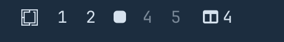

# Scrolling Columns

An [Omarchy](https://omarchy.org/) bar widget that sets how many columns fill the
screen in Hyprland's scrolling layout — tracked **per workspace**.



## Why per workspace

Hyprland stores a width on every column, so a workspace you have already set
stays set through focus changes and config reloads. What is *global* is only the
width handed to the next new column — `ScrollingAlgorithm::defaultColumnWidth()`
reads `scrolling:column_width` with no workspace context.

So the widget's real job is re-pointing that one global at the active workspace
whenever focus moves. The click target is just how you pick the number.

## Install

```bash
omarchy plugin add https://github.com/scttymn/omarchy-scrolling-columns.git --enable
```

Requires the scrolling layout on the workspace you want to affect — toggle it
with `SUPER + L`. The widget dims on tiled (dwindle) workspaces.

## Use

| Gesture | Effect |
| --- | --- |
| Left click / wheel up | +1 column (wraps) |
| Right click / wheel down | −1 column (wraps) |
| Middle click | Toggle the workspace between scrolling and dwindle |

Setting a workspace to the default count *unpins* it rather than storing an
identical override, so it keeps following `defaultColumns` if you change that
later. The tooltip shows which state you are in.

## Settings

Set them in `~/.config/omarchy/shell.json`, or with `omarchy bar set`:

```bash
omarchy bar set scttymn.scrolling-columns defaultColumns 3
```

| Key | Default | Meaning |
| --- | --- | --- |
| `defaultColumns` | `2` | Column count for workspaces with no explicit setting |
| `maxColumns` | `6` | Upper bound for the click/wheel cycle |
| `usableWidth` | `1.0` | Fraction of the screen the columns span. Below `1.0` leaves slack at the edges while the tape overflows — see *Edge peek* below |
| `probeIntervalMs` | `2000` | Poll interval for layout and column-count changes |
| `hideOnDwindle` | `false` | Hide the widget entirely on tiled workspaces instead of dimming it |

### Edge peek

`usableWidth` below `1.0` shrinks columns so a sliver of the neighbouring column
shows. It is off by default because it does not pay for itself: the slack has to
land somewhere, and at either end of the tape it becomes dead space rather than a
neighbour. With 4 columns and 3 fitting you are always near an end. Columns
either tile the screen exactly (no peek, no cut columns) or they do not (peek,
dead space at the ends) — there is no setting that gives both. It may be worth
enabling on a much longer tape, where you are mid-scroll most of the time.

## Suggested keybindings

The widget sets the column *count*; these pan and reorder the tape. Add to
`~/.config/hypr/bindings.lua`:

```lua
o.bind("SUPER + code:34", "Pan columns backward", hl.dsp.layout("move -col"))
o.bind("SUPER + code:35", "Pan columns forward", hl.dsp.layout("move +col"))
o.bind("SUPER + SHIFT + code:34", "Swap column left", hl.dsp.layout("swapcol l"))
o.bind("SUPER + SHIFT + code:35", "Swap column right", hl.dsp.layout("swapcol r"))
o.bind("SUPER + SHIFT + mouse_down", "Pan columns forward", hl.dsp.layout("move +col"))
o.bind("SUPER + SHIFT + mouse_up", "Pan columns backward", hl.dsp.layout("move -col"))
```

`code:34` and `code:35` are `[` and `]`; Omarchy addresses punctuation by keycode.

## What it writes

Plugins run unsandboxed inside the `omarchy-shell` process, so here is everything
this one touches:

- `~/.local/state/omarchy/scttymn.scrolling-columns.json` — the per-workspace
  column counts.
- `~/.local/state/omarchy/toggles/hypr/scttymn-scrolling-columns.lua` — a
  `column_width` default so `hyprctl reload` lands somewhere sensible before the
  widget re-syncs. **This directory is sourced into your Hyprland config.** The
  filename uses hyphens rather than dots deliberately: `require_all` strips
  `.lua` and calls `require()` on the rest, so a dotted name is read as a Lua
  module path, fails to resolve, and takes every other toggle down with it.
- It shells out to `hyprctl eval` and `hyprctl dispatch` to apply widths, and to
  `omarchy-hyprland-workspace-layout-toggle` on middle click.

## License

MIT — see [LICENSE](LICENSE).
